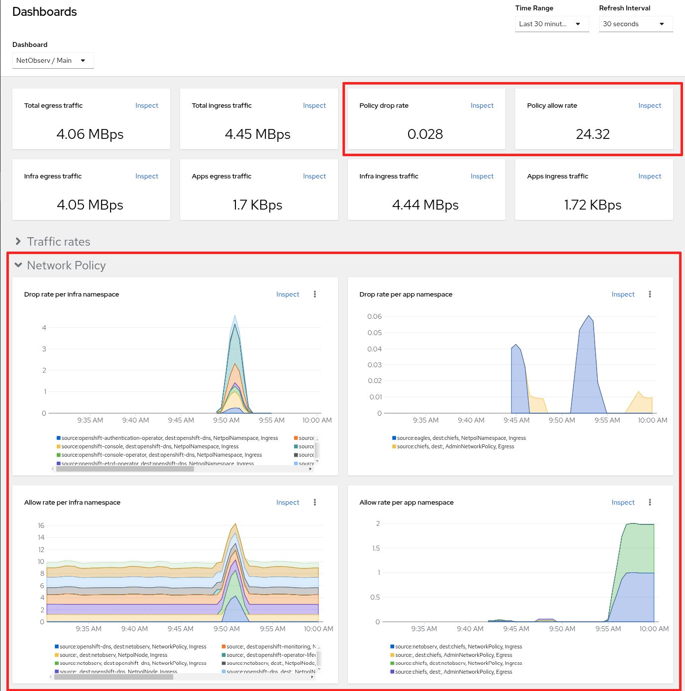
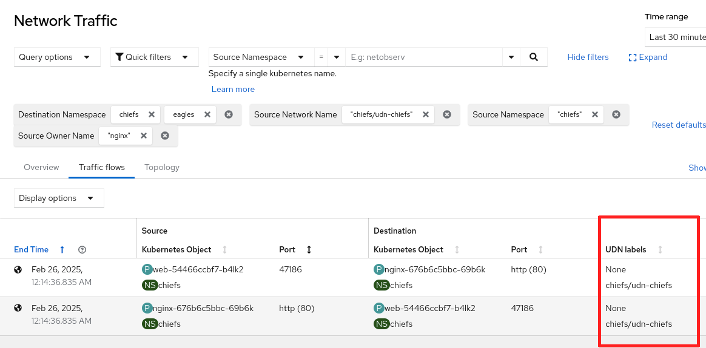
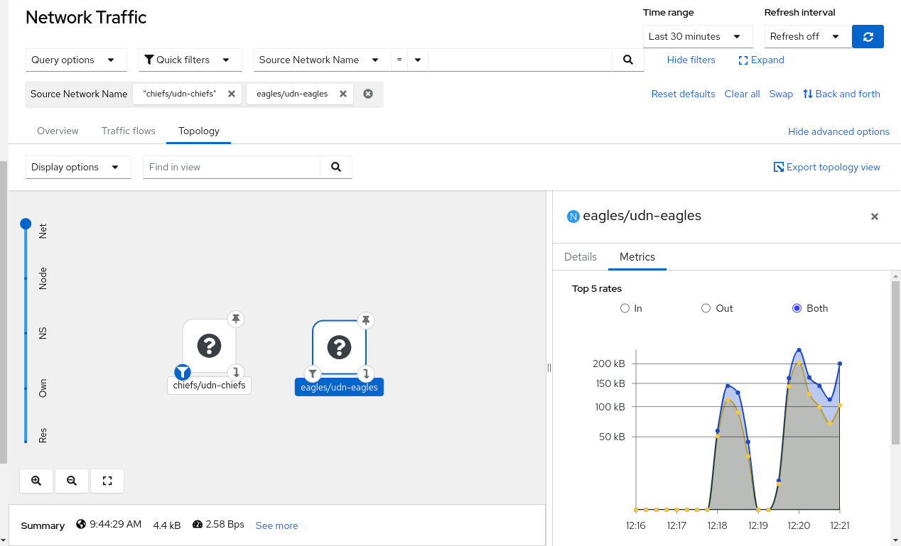
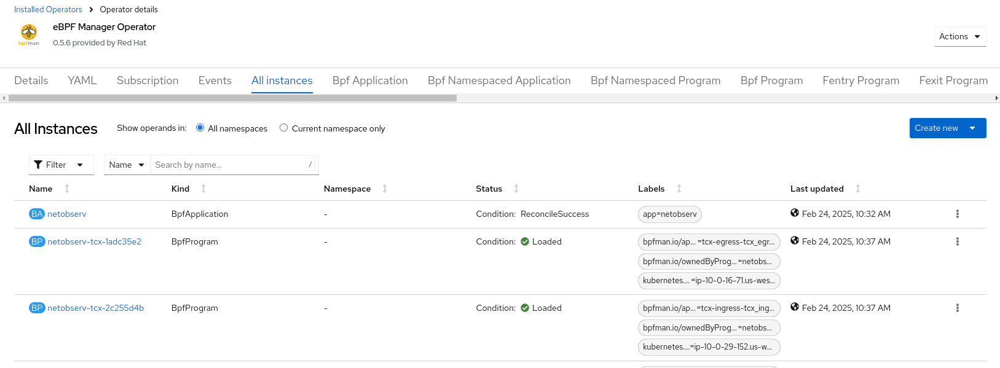

_Thanks to Joel Takvorian, Mohamed S. Mahmoud, Julien Pinsonneau, Mike Fiedler, Sara Thomas, and Mehul Modi for reviewing._

Network observability is one of the most critical and must-have components in your Kubernetes cluster.  When networking stops working or slows down, your productivity essentially grinds to a halt.  With that said, let me introduce you to Network Observability 1.8, which aligns with Red Hat [OpenShift Container Platform (OCP) 4.18](https://docs.openshift.com/container-platform/4.18/release_notes/ocp-4-18-release-notes.html).  While it supports older versions of OCP and any Kubernetes cluster, many of the new features require 4.18 and specifically, OVN-Kubernetes as your Container Network Interface (CNI).

If you read [my blogs](https://developers.redhat.com/author/steven-lee) on this topic, I tend to give a sneak peek on Developer Preview (DP) features as well as Technology Preview (TP) features.  In both cases, they should not be used in production until they reach General Availability (GA).  I also cover only the new features, so if you want an overview of everything in Network Observability, check out [About Network Observability](https://docs.openshift.com/container-platform/4.18/observability/network_observability/network-observability-overview.html) in the Red Hat documentation.

## Setup

To begin, you should have an OCP cluster, preferably 4.18 so you can test the new features, and [Network Observability Operator 1.8 installed](https://docs.openshift.com/container-platform/4.18/observability/network_observability/installing-operators.html#network-observability-operator-installation_network_observability).  Install Loki using the Loki Operator or  a monolithic Loki (non-production) by following the instructions in the Network Observability Operator in the OpenShift web console.  Create a FlowCollector instance and enable Loki.  By default, it should be running OVN-Kubernetes.  You should also have the OpenShift CLI ([`oc`](https://docs.openshift.com/container-platform/4.18/cli_reference/openshift_cli/getting-started-cli.html)) installed on your computer.  Now let's dive in!

## Features

This release is unusual in that there are just two items I will cover in the GA category.  They are packet translation and eBPF resource reduction.  The rest are the upcoming features that fall into the Developer Preview and Technology Preview categories.

There were also significant changes in the Network Observability CLI, a kubectl plug-in that lets you use Network Observability from the command line, separate from the operator.  I've talked about this in the past, but it has grown with many great new features, so you can now read all about it in [Network Observability On Demand 1.8 Update](https://netobserv.io/posts/network-observability-on-demand-1-8-update/).

### Packet Translation

When a client accesses a pod through its Kubernetes service, it does a reverse proxy to the server running on a pod.  In the OpenShift web console, go to **Observe > Network Traffic, Traffic flows** tab.  The table shows two separate flows, one from the client to the service and another from the client to the pod.  This makes tracing the flow fairly difficult.  Figure 1 shows an Nginx server accessing another Nginx server on a different namespace.

<br>
Figure 1: Flows table without Packet Translation

With Packet Translation, a few xlate-related columns are added.  The first row with the service shows the translated namespace and pod for the source and destination (Figure 2).


Figure 2: Flows table with Packet Translation

To enable this feature in FlowCollector, enter `oc edit flowcollector` and configure the following in the **ebpf** section:

```yaml
spec:
  agent:
    ebpf:
      sampling: 1  # recommended so all flows are observed
      features:
      - PacketTranslation
```

<p style="text-align: center">Listing 1: Enable Packet Translation feature in FlowCollector</p>

To create a basic Nginx web server, enter the following commands on the command line.  I created two of them, one with the namespace "chiefs" and another with namespace "eagles".

```bash
oc new-project chiefs
oc adm policy add-scc-to-group anyuid system:authenticated
oc create deployment nginx --image=nginx
oc expose deployment/nginx --port=80 --target-port=80
oc expose svc/nginx
```

<p style="text-align: center">Listing 2: Create an Nginx web server deployment</p>

For more detailed information on Packet Translation, see the article on [Enhancing NetObserv for Kubernetes Service Flows using eBPF](https://netobserv.io/posts/enhancing-netobserv-for-kubernetes-service-flows-using-ebpf/).


### eBPF Resource Reduction

In an ideal world, observability would take zero resources, but since that's not realistic, the goal is to use the least amount of resources as possible, particularly in CPU and memory usage.

The great news is that 1.8 made some significant resource savings in the eBPF area.  Testing showed that in the 25-node and 250-node cluster scenarios, the savings range from 40% to 57% compared to 1.7.  Before you get too excited, this is eBPF only so when you look at the overall Network Observability, the savings are closer to 11% to 25%, which is still impressive.  Obviously, your savings will vary depending on your environment.

There were two major changes made to the eBPF Agent, which is the component that collects and aggregates flows in Network Observability.  The way hash maps were used and the algorithm to handle concurrency were changed to split this up into two hash maps, one for collecting and processing data and another for enriching the data with Kubernetes information.  Ultimately, this approach uses less memory and CPU cycles than having a hash map per CPU.  Further savings in CPU and memory usage were achieved also due to the hash map change, by doing more de-duplication in reducing the hash map key, based on 12 tuples to essentially 5.  De-duplication is the process of removing copies of the same packet that the eBPF Agent sees on different interfaces as it traverses through the network.

For more information on this topic, see the article on [Performance improvements in 1.8](https://netobserv.io/posts/performance-improvements-in-1-8/).


## Developer and Technology Preview Features

The rest of the features are non-GA, meaning they should not be used in a production environment.  Network Events is a Technology Preview feature and the rest are Developer Preview features.

1. Network Events for Monitoring Network Policies
2. eBPF Flow Filtering Enhancements
3. UDN Observability
4. eBPF Manager Support


### Network Events for Monitoring Network Policies

With OVN-Kubernetes and Network Events, you can see what's happening with a packet, including why a packet was dropped or what network policy allowed or denied a packet from going through.  This gives you incredible insight into troubleshooting and is a long-awaited feature!

On OVN-Kubernetes, this is disabled by default since this is a Technology Preview feature, so enable it by adding the feature gate named **OVNObservability**.  On the command line, enter `oc edit featuregate` and change the **spec** section to:

```yaml
spec:
  featureSet: CustomNoUpgrade
  customNoUpgrade:
    enabled:
      - OVNObservability
```

<p style="text-align: center">Listing 3: Enable OVNObservability feature gate</p>

This can take upwards of *10+ minutes* for this to take effect, so be patient.  Initially, it might seem like nothing has happened, but after about five minutes, you will lose connection to your cluster because OVN-Kubernetes has to restart.  Then after another five minutes, everything should be back online.

To enable this feature in FlowCollector, enter `oc edit flowcollector` and configure the following in the **ebpf** section:

```yaml
spec:
  agent:
    ebpf:
      sampling: 1  # recommended so all flows are observed
      privileged: true
      features:
      - NetworkEvents
```

<p style="text-align: center">Listing 4: Enable NetworkEvents feature in FlowCollector</p>

A packet could be dropped for many reasons, but oftentimes, it's due to a network policy.  In OCP, there are three different types of network policies.  Network Events supports all three.  Click the links to learn how to configure them.

1. [Kubernetes Network Policy](https://docs.openshift.com/container-platform/4.18/networking/network_security/network_policy/about-network-policy.html) &mdash; similar to a firewall rule, typically based on an IP address, port, and protocol
2. [Admin Network Policy](https://docs.openshift.com/container-platform/4.18/networking/network_security/AdminNetworkPolicy/ovn-k-anp.html) &mdash; allows cluster admin to create policies that are at the cluster level
3. [Egress Firewall](https://docs.openshift.com/container-platform/4.18/networking/network_security/egress_firewall/viewing-egress-firewall-ovn.html) &mdash; controls what external hosts a pod can connect to

In Figure 3, the Traffic flows table shows a column for Network Events.  The first row shows a drop from a network policy and the second row allowed the packet in an admin network policy.


Figure 3: Flows table with Network Events

There are also Network Policy dashboards in **Observe > Dashboards**.  Select **NetObserv / Main** from the Dashboard dropdown (Figure 4).


Figure 4: Network Policy dashboards

For more detailed information on Network Events, see the article on [Monitoring OVN Networking Events using Network Observability](https://netobserv.io/posts/monitoring-ovn-networking-events-using-network-observability/).

### eBPF Flow Filter Enhancements

eBPF flow filter was first introduced in Network Observability 1.6.  It lets you decide what you want to observe at the initial collector stage, so you can minimize the resources used by observability.  It comes with more enhancements in this release.

#### More than one flow filter rule

Instead of one filter rule, you can now have up to 16 rules, thus removing a major limitation of this feature.  The rule that is matched is based on the most specific CIDR match, that is the one with the longest prefix.  Hence, no two rules can have the same CIDR.  After that, if the rest of the rule is matched, the action, accept or reject, is taken.  If the rest of the rule is not matched, it is simply rejected; it does not attempt to match another rule.

For example, suppose there is a rule with CIDR 10.0.0.0/16 and another with 10.0.1.0/24, then if the address is 10.0.1.128, it would match the second rule because that's more specific (24-bit prefix vs. 16-bit prefix).  Suppose the second rule also has **tcpFlags: SYN** and **action: Accept**.  Then if it's a SYN packet, it's accepted, otherwise it's rejected and it doesn't attempt to apply the first rule.

#### Peer CIDR

`peerCIDR` is a new option that specifies the address on the server side, which is the destination when you make a request and the source when it makes a response.  There still exists a `peerIP` that can only specify a host.  However, with `peerCIDR`, you can simply use it to specify a host (/32) or a subnetwork.

In summary, use `cidr` for the client side address and `peerCIDR` for the server side address.

#### Sampling rate per rule

Each rule can have its own sampling rate.  For example, you might want the eBPF Agent to sample all external traffic on source and destination, but for internal traffic, it's sufficient to sample at 50.  Listing 5 shows how this can be done, assuming the default IP settings of 10.128.0.0/14 for pods and 172.30.0.0/16 for services.

```yaml
spec:
  agent:
    type: eBPF
    ebpf:
      flowFilter:
        enable: true
        rules:
          - action: Accept
            cidr: 10.128.0.0/14      # pod
            peerCIDR: 10.128.0.0/14  # pod
            sampling: 50
          - action: Accept
            cidr: 10.128.0.0/14      # pod
            peerCIDR: 172.30.0.0/16  # service
            sampling: 50
          - action: Accept
            cidr: 0.0.0.0/0
            sampling: 1
```

<p style="text-align: center">Listing 5: Flow filter with different sampling value</p>

The last rule with CIDR 0.0.0.0/0 is necessary to explicitly tell it to process the rest of the packets.  This is because once you define a flow filter rule, the default behavior of using the FlowCollector's sampling value to determine what packets to process no longer applies.  It will simply use the flow filter rules on what to accept or reject and reject the rest by default.  If sampling is not specified in a rule, it uses the FlowFilter's sampling value.

#### Include packet drops

Another new option is **pktDrops**.  With **pktDrops: true** and **action: Accept**, it includes the packet only if it's dropped.  The prerequisite is that the eBPF feature, **PacketDrop** is enabled, which requires eBFP to be in **privileged** mode.  Note this currently is not supported if you enable the **NetworkEvent** feature.  Listing 6 shows an example configuration.

```yaml
spec:
  agent:
    type: eBPF
    ebpf:
      privileged: true
      features:
        - PacketDrop
      flowFilter:
        enable: true
        rules:
          - action: Accept
            cidr: 10.1.0.0/16
            sampling: 1
            pktDrops: true
```

<p style="text-align: center">Listing 6: Flow filter with packet drop example</p>

For more information and use cases on eBPF Flow Filter, see the article on [Enhancing NetObserv By Introducing Multi Rules Flow filtering capability in eBPF](https://netobserv.io/posts/enhancing-netobserv-by-introducing-multi-rules-flow-filtering-capability-in-ebpf/).


### UDN Observability

Kubernetes networking consists of a flat Layer 3 network and a single IP address space where every pod can communicate with any other pod.  In a number of use cases, this is undesirable.  OVN-Kubernetes provides another model called [User-Defined Networks](https://docs.openshift.com/container-platform/4.18/networking/multiple_networks/primary_networks/about-user-defined-networks.html) (UDN).  It supports microsegmentation where each network segment, which could be Layer 2 or Layer 3, is isolated from one another.  Support for UDN in Network Observability includes changes in the flow table and topology.

To enable this feature in FlowCollector, enter `oc edit flowcollector` and configure the following in the **ebpf** section:

```yaml
spec:
  agent:
    ebpf:
      sampling: 1  # recommended so all flows are observed
      privileged: true
      features:
      - UDNMapping
```

<p style="text-align: center">Listing 7: Enable UDNMapping feature in FlowCollector</p>

Let's create a user-defined network based on a namespace (Listing 8).

```yaml
apiVersion: v1
kind: Namespace
metadata:
  name: 49ers
  labels:
    k8s.ovn.org/primary-user-defined-network: ""
```

<p style="text-align: center">Listing 8: Namespace for UDN</p>

This creates a new namespace with the label **k8s.ovn.org/primary-user-defined-network** set to an empty string.  A new namespace has to be created, because it's not allowed to add certain labels like this one to an existing namespace.

You can use `oc apply` with the content in Listing 8, or copy and paste this into the OpenShift web console.  To do the latter, click the **+** icon in the upper right corner next to the **?** icon, and select **Import YAML**.  Paste the YAML in and click **Create**.

Now create a UserDefinedNetwork instance (Listing 9).  Again, use `oc apply` or paste into OpenShift web console.

```yaml
apiVersion: k8s.ovn.org/v1
kind: UserDefinedNetwork
metadata:
  name: udn-49ers
  namespace: 49ers
spec:
  topology: Layer2
  layer2:
    role: Primary
    subnets:
      - "10.0.0.0/24"
```

<p style="text-align: center">Listing 9: UDN - Layer 2 network segment</p>

Now if you add a pod into this namespace, it will automatically have a secondary interface that is part of the UDN.  You can confirm this by entering the commands in Listing 10.

```bash
oc project 49ers
pod=$(oc get --no-headers pods | awk '{ print $1;}') # get pod name
oc describe pod/$pod  # should see two interfaces mentioned in Annotations
```

<p style="text-align: center">Listing 10: Add secondary interface to pod</p>

All pods in this namespace are isolated from pods in other namespaces.  In essence, a namespace can be a tenant.  The UDN feature also has a **ClusterUserDefinedNetwork** resource that allows a UDN to span across multiple namespaces.

In Network Observability, the Traffic flow table has a **UDN labels** column (Figure 5).  You can filter on **Source Network Name** and **Destination Network Name**.


Figure 5: Flows table with UDN labels

In the Topology tab, there is a new top-level scope called **Net** (Network).  This shows all of your secondary networks.  Figure 6 shows two UDNs.


Figure 6: Topology showing UDNs


### eBPF Manager Support

With the proliferation of eBPF programs in networking, monitoring, tracing, and security, there is potential for conflicts in the use of the same eBPF hooks.  The eBPF Manager is a separate operator that manages all eBPF programs, thereby reducing the attack surface, and ensuring compliance, security, and preventing conflicts.  Network Observability can leverage eBPF Manager and let it handle the loading of hooks, ultimately removing the need to provide the eBPF Agent with *privileged* mode or additional Linux capabilities such as CAP_BPF and CAP_PERFMON.  Since this is a Developer Preview feature, *privileged* mode is still required for now, and it is only supported on the amd64 architecture.

First, install the eBPF Manager Operator from **Operators > OperatorHub**.  This deploys the bpfman daemon and installs the Security Profiles Operator.  Check **Workloads > Pods** in the **bpfman** namespace to make sure they are all up and running.

Then install Network Observability and configure the FlowCollector resource in Listing 11.  Because this is a Developer Preview feature, delete the FlowCollector instance if you already have one and create a new instance, rather than edit an existing one.

```yaml
spec:
  agent:
    ebpf:
      privileged: true  # required for now
      interfaces:
        - br-ex
      features:
        - eBPFManager
```

<p style="text-align: center">Listing 11: Enable eBPFManager feature in FlowCollector</p>

It must specify an interface, such as **br-ex**, which is the OVS external bridge interface.  This lets eBPF Manager know where to attach the TCx hook.  Normally, the interfaces are auto-discovered, so if you don't specify all the interfaces, it won't get all the flows.  This is work in progress.

To verify that this is working, go to **Operators > Installed Operators**.  Click **eBPF Manager Operator** and then the **All instances** tab.  There should a BpfApplication named **netobserv** and a pair of BpfProgram, one for TCx ingress and another for TCx egress, for each node.  There might be more if you enable other eBPF Agent features.


Figure 7: eBPF Manager - All Instances


## Summary

This is another feature-rich release that works hand-in-hand with OVN-Kubernetes.  Getting insight into how packets are translated when accessing a pod through a service and knowing where a packet is dropped will be immensely helpful in troubleshooting.  Support for microsegmentation via UDNs will improve security and management.

Network Observability continues to provide flexibility in deciding what you want to observe so that you can minimize the resources used.  This is in addition to the internal optimizations that we've made in this release.

While many of the features are in Developer Preview, it gives you a chance to try these out and give us some feedback before it becomes generally available.  You can write comments and contact us on the [discussion board](https://github.com/netobserv/network-observability-operator/discussions).
